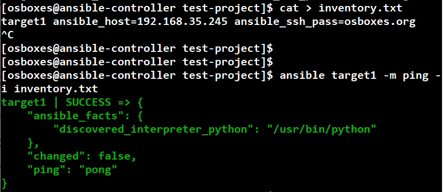

# 1. Jmeter 설치

본 문서는 Jmeter 5.1.1버전(Java 8버전 이상에서 지원)으로 작성되었다.
	설치 파일 다운로드
-	http://mirror.navercorp.com/apache//jmeter/binaries/apache-jmeter-5.1.1.zip
	Jmeter 실행
-	{압축 해제 경로}\bin\jmeter.bat 실행
	여기서 잠깐!! PC에 개발환경이 구성되어 있어 JAVA_HOME의 jdk 버전이 1.6이여서 실행이 안되는 경우, jmeter실행파일에서jdk의 minimal 버전을 1.6으로 변경 후1.8버전 이상의 jdk 경로를 수동으로 설정하시기 바랍니다.
아래는 PC의 JAVA_HOME이 1.6으로 설정되어 있고, jdk 1.8을 별도로 설치했을때의 예시이다.

1) (예시), {압축 해제 경로}\bin\jmeter.bat 파일의 80번째 줄 수정
   set MINIMAL_VERSION=1.6.0

2) (예시), {압축 해제 경로}\bin\jmeter.bat 파일의 132번째 줄 수정
   set JM_LAUNCH=C:\Program Files\Java\jdk1.8.0_271\bin\java.exe


## 1-2. Jmeter Recording설정
Jmeter의 TestPlan (테스트할 기능 레코딩)이 이미 작성되어 있는 경우에는 이 과정을 생략하고 “3. Jmeter 테스트 방법”을 진행합니다.
Jmeter Recording을 위해서는 Jmeter의 설정과 테스트를 진행하는 PC의 프록시 설정이 필요합니다.
※	여기서 잠깐!! cloudium의 RPC프로토콜이 5.19.04에서 XML에서 메시지팩으로 변경된 뒤 Jmeter의 Recording이 동작하지 않으므로, 5.19.04보다 이전 버전에서만 진행하시기 바랍니다.
	Jmeter Recording 설정
-	PC와 서버간 http 요청 행위를 기록해서 해당 행위에 대한 반복 테스트를 진행할 수 있다.


## 1-2. 왜 앤서블?

이미 잘 운영되고 있는 서버들에 **동일한 명령어를 수행해야 할 때가 있습니다**.

* 신규 입사자를 위한 서버 계정 생성
  * 클라우드에서는 ec2-user로 다 통일해서 쓰는 경우가 있는데 IDC 정책상 개발자마다 서버 계정 발급 받아 써야하는 경우가 많습니다.
* 기존 사용자의 비밀번호 변경
* 기존 사용자의 Sudo 권한 제거
 

이걸 해결하기 위해 쉘 스크립트를 이용해 전체 서버에 명령을 수행하기도 합니다.  
  

  
**전체 서버에 동일한 명령어**를 안정적으로 수행하고 **이력 관리**가 되는게 필요하면 도구의 힘을 빌리는게 편합니다.  
  
앤서블 이외에도 Puppet, Chef, Salt 등이 있습니다.  
이 중에서 앤서블을 선택한 이유는 다음과 같습니다

-자동 배포 환경이 쉬움

-활발한 오픈소스

-play book을 통한 Infrastructure as Code(작업시 노동시간 감소, 코드화에 의한 고도의 품질 보증)

-ad-hoc 지원 - 임시적으로 수행하는 의미, 작업중에 별도의 일을 하기 위해 명령어를 날리는 것 정도로 이해

-병렬 provisioning 지원 - 여러 서버를 병렬적으로 provisioning 한다는 말 같음

-멱등성을 가지고 있음

등등이 있고 또 많은 엔지니어들이 사용하고 있습니다


## 1-3. 앤서블 설치

설치 할때 pip 명령어를 사용하면 각종 다양한 os에 적용되므로 편리합니다.

공식문서를 따라가며 설치한 후 명령어를 수행해봅시다.



그리고 명령어를 한번 수행해봅니다.

```bash
ansible localhost -m ping
```

여기까지 확인되셨다면 설치가 성공적으로 되신겁니다.  
앤서블 서버 설정이 다 되었으니 호스트들을 등록하겠습니다.

## 1-4. 호스트 등록
  
앤서블은 ```/etc/ansible/hosts``` 에 있는 호스트 정보를 기본적으로 읽어갑니다.  
  
그래서 아래와 같이 ```/etc/ansible/hosts```을 열어 호스트 정보를 등록합니다.

```bash
vim /etc/ansible/hosts
```

등록 방법은 아래처럼 사용하면 됩니다.

```bash
[web]
호스트IP1
호스트IP2
```

다 등록 되셨다면 호스트로 접근이 되는지 한번 테스트 해봅니다.

```bash
ansible all -m ping
```

그럼 아래와 같이 처음으로 ssh 접속에 대한 메세지가 보입니다.  
해결책은 ```yes```를 입력하는 것입니다.


**앤서블서버**

ssh [호스트ip] 을 한번 함으로써 호스트에 접근할수 있게 됩니다. 
  

그리고 다시 한번 ping 테스트를 해봅니다.  


명령어를 실행해보시면!


ping이 성공적으로 호스트 전체에 실행된 것을 확인할 수 있습니다.


## 1-5. 다음 과정 안내

가장 첫번째 과정으로 앤서블 서버와 호스트 서버간에 연결을 해보았습니다.  
다음엔 **앤서블플레이북 작성 및 플레이북 실행을 해보겠습니다**
